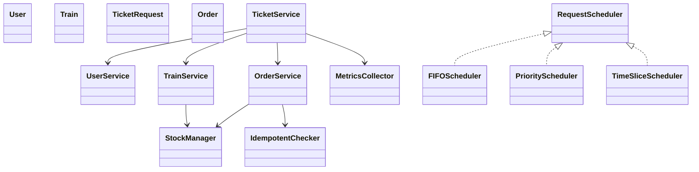
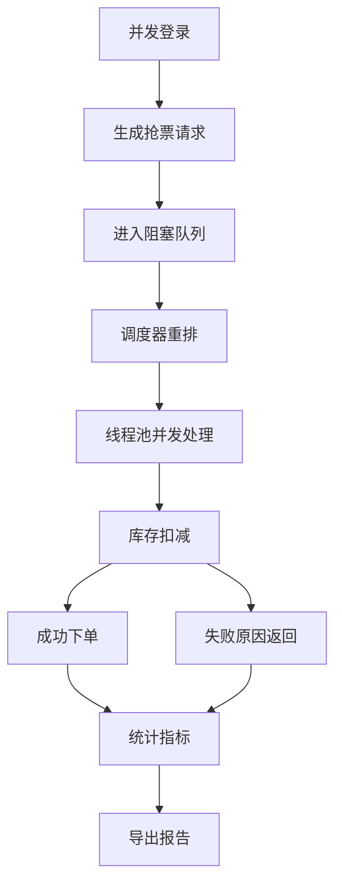

# 高并发高铁抢票模拟系统

基于 Java 8 + 多线程 + 调度算法的内存版高并发抢票模拟项目。系统仅使用内存数据结构完成库存、队列、调度、幂等、限流、异常回滚与指标统计，不引入额外存储或第三方框架。

## 技术栈

- Java 8+
- ThreadPoolExecutor
- ReentrantLock
- Atomic 原子类
- ConcurrentHashMap
- BlockingQueue

## 目录说明

- `src/entity`：用户、车次、请求、订单实体
- `src/concurrent`：线程池、阻塞队列、库存安全扣减、幂等控制
- `src/scheduler`：FIFO、优先级、时间片三种调度器
- `src/service`：用户、车次、订单、抢票主流程服务
- `src/stats`：QPS、成功率、平均响应时间、P95 统计与报告导出
- `src/exception`：队列满、库存不足、超时异常
- `src/Main.java`：入口与压测对比

## 运行方式

1. 使用 IntelliJ IDEA 打开项目。
2. 直接运行 `src/Main.java`。
3. 可选参数：
   - 第 1 个参数：请求数，默认 `3000`
   - 第 2 个参数：用户数，默认 `500`
   - 第 3 个参数：报告文件名，默认 `ticket-sim-report.txt`

示例：

```text
java Main 10000 2000 custom-report.txt
```

## 核心流程

1. 并发登录生成唯一用户 ID。
2. 生成 1000~10000 条抢票请求，注入重复业务键验证幂等。
3. 请求进入 `BlockingQueue` 缓冲队列。
4. 调度器按 FIFO、优先级、时间片重排请求。
5. 线程池并发处理请求，库存使用 `AtomicInteger` + `ReentrantLock` 双重保护。
6. 订单生成并输出成功 / 失败原因。
7. 统计 QPS、成功率、平均时延、P95，并导出文本报告。

## 调度算法说明

- FIFO：完全按到达顺序处理。
- 优先级调度：优先处理高优先级用户。
- 时间片调度：按固定批次轮转处理，避免单批独占资源。

## 类图



## 流程图



## 说明

本项目是纯内存模拟，方便用于并发控制、调度策略与压测指标的课程实践或原型验证。若后续扩展到数据库，只需补充持久化层接口即可，不影响当前内存版核心逻辑。